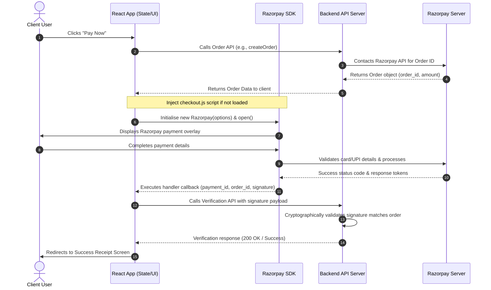

# Empower 2026: Payment Forms, Fields, & Flow Analysis

This document provides a detailed breakdown of all payment-related forms, fields, APIs, and the checkout/verification flows in the Empower 2026 frontend registration system.

---

## 1. Architecture Overview

The application utilizes **Razorpay** as the primary payment gateway. The payment flow is managed through:
- **SDK Loader**: Dynamic insertion of the Razorpay checkout script (`https://checkout.razorpay.com/v1/checkout.js`).
- **Backend Order Creation**: Before opening the checkout modal, the frontend calls the backend to generate a Razorpay order ID and return transaction metadata.
- **Razorpay Checkout Dialog**: Standard modal containing payment methods (card, UPI, net banking, wallets).
- **Backend Signature Verification**: Once payment completes successfully on the client side, the payload (payment ID, order ID, signature) is sent to the backend for cryptographic validation.
- **Zero Payment Flow**: For registrations where the coupon code brings the total price down to ₹0, a bypass route is used directly without loading Razorpay.

---

## 2. Individual / Delegate Registration Flow (`Register.js`)

Located at: [Register.js](file:///c:/Users/HP/Desktop/vedant/empower2026/src/components/authentication/Register.js)

### Form States & Transitions
Individual registration is managed via a step-by-step progress wizard:
1. **State 1: Account** – Profile inputs (Name, Affiliation, Disability Status).
2. **State 2: Profile** – Photo upload, designation, gender, and type of registration.
3. **State 3: Payment** – Price calculation summary, coupon discount validation, and execution of the Razorpay checkout.
4. **State 4: Summary / Receipt** – Rendered by [PaymentReceipt.js](file:///c:/Users/HP/Desktop/vedant/empower2026/src/razorpay/PaymentReceipt.js) on successful verification.

### Key Fields & Input Forms
| Component / Field | Description | Rules / Calculated Side-Effects |
| :--- | :--- | :--- |
| **`registrationType`** | Dropdown selection (e.g., "Delegate", "Student", "Person with Disability"). | Influences base pricing category. |
| **`registrationCategory`**| Selection between "Full Conference" and "One day Conference". | Controls daily multiplication logic. |
| **`daySelects`** | Array of selected day dates if "One day Conference" is chosen. | Multiplies pricing by `daySelects.length`. If all 3 days are chosen, automatically upgrades registration to "Full Conference". |
| **`isAccompanyPerson`** | Checkbox indicating if an accompanying person is attending. | Toggles accompany form inputs. |
| **`accompanyPerson`** | Sub-form fields: `firstName`, `lastName`, `mobileOrEmail`. | Adds `accompanyPersonFee` dynamically. |
| **`couponCode`** | Text input field verified against backend API. | Subtracts `coupon.price` from total balance. |

### Pricing Formulas
Based on the constants defined in [data.js](file:///c:/Users/HP/Desktop/vedant/empower2026/src/components/attend/data.js):
- **Delegate base fee**: Full Conference = ₹6,000 (Standard) | One Day = ₹2,400 (Standard) per day.
- **Student / PwD base fee**: Full Conference = ₹3,000 (Standard) | One Day = ₹1,500 (Standard) per day.
- **Accompanying Person**: Full Conference = ₹1,200 (Standard) | One Day = ₹600 (Standard) per day.
- **Calculation Formula**:
  $$\text{Total} = \max\left(0, \text{BaseFee} + \text{AccompanyPersonFee} - \text{Discount}\right)$$

---

## 3. Exhibitor Registration Flow (`ExhibitorRegister.js`)

Located at: [ExhibitorRegister.js](file:///c:/Users/HP/Desktop/vedant/empower2026/src/components/authentication/exhibior/ExhibitorRegister.js)

### Form States & Transitions
Exhibitor registration follows a 5-step progress bar:
1. **State 1: Account / Org Details** – Selects booth options, specifies basic organization and contact details.
2. **State 2: Organization details** – Branding logos, promotional materials, billing addresses, and GST numbers.
3. **State 3: Participant** – Allocates complimentary participant passes (number of passes is bound to stall tier).
4. **State 4: Review** – Displays final review screen, coupon code entry, and payment totals.
5. **State 5: Payment / Receipt** – Rendered by [ExhibitorPaymentReceipt.js](file:///c:/Users/HP/Desktop/vedant/empower2026/src/razorpay/ExhibitorPaymentReceipt.js).

### Key Fields & Input Forms
| Component / Field | Description | Rules / Calculated Side-Effects |
| :--- | :--- | :--- |
| **`boothType`** | Selects Platinum, Gold, or Silver booth. | Resolves early-bird pricing and complementary attendee counts. |
| **`organizationDetails`**| Sub-fields: `organizationName`, `exhibitType`, `website`, `description`. | Basic metadata. |
| **`primaryContactDetails`**| Sub-fields: `fullName`, `designation`, `email`, `mobile`, `linkedInUrl`. |Prefilled details for Razorpay options. |
| **`brandingDetails`** | Uploaded `companyLogo`, `promotionalMaterial`, and `socialMedia`. | Files must be $\le$ 2MB (Logo) or $\le$ 10MB (Promotions). |
| **`billingDetails`** | Inputs for `doorNo`, `addressLine1`, `addressLine2`, `city`, `state`, `pincode`, `gstNo`. | Essential fields for standard invoicing. |

### Pricing Formulas
Based on the constants defined in [data.js](file:///c:/Users/HP/Desktop/vedant/empower2026/src/components/exhibit/data.js):
- **Platinum Stall**: ₹14,000 (Early Bird) / ₹17,000 (Standard) | 3 complimentary participants.
- **Gold Stall**: ₹10,500 (Early Bird) / ₹12,500 (Standard) | 2 complimentary participants.
- **Silver Stall**: ₹7,000 (Early Bird) / ₹8,500 (Standard) | 1 complimentary participant.
- **Calculation Formula**:
  $$\text{Total} = \max\left(0, \text{StallPrice} - \text{Discount}\right)$$

---

## 4. Organization / Bulk Registration Flow (`OrganizationRegistration.js`)

Located at: [OrganizationRegistration.js](file:///c:/Users/HP/Desktop/vedant/empower2026/src/components/authentication/organization/OrganizationRegistration.js)

### Registration Flow
1. **Verification Phase**: The user enters `organizationName`, `email`, and `mobile` and receives a 4-digit OTP. Verification authenticates the organization's backend account.
2. **Members Setup**: Once verified, a tabular input interface is exposed enabling the organization to dynamically add rows of member groups.
3. **Calculation Phase**: The row total updates in real-time.
4. **Execution Phase**: The aggregate sum of all rows triggers a single unified Razorpay checkout overlay.

### Tabular Input Fields
For each row added to the grid:
- **`registrationType`**: Dropdown (e.g., Delegate, Student, Person with Disability).
- **`registrationCategory`**: Category select ("Full Conference" or "One day Conference").
- **`daySelects`**: Multi-select dropdown list (applicable when category is "One day Conference").
- **`numberOfPeople`**: Count of delegates matching this row's constraints.
- **`amount`**: Computed locally using the Early Bird configurations:
  $$\text{Row Amount} = \text{PricePerCategory} \times \text{numberOfPeople}$$

### Pricing Rules (Early Bird)
- **Delegate Early Bird**: Full Conference = ₹4,750 | One Day = ₹1,750 per day.
- **Student / PwD Early Bird**: Full Conference = ₹2,400 | One Day = ₹1,200 per day.

---

## 5. Sequence diagram of Razorpay checkout

---

## 6. Payment API Endpoint Specifications

All endpoints are configured inside [api.js](file:///c:/Users/HP/Desktop/vedant/empower2026/src/services/api.js):

| API Endpoint | Request Method | Purpose | Associated Components |
| :--- | :--- | :--- | :--- |
| `/api/empower/payment/create-order` | `POST` | Initiates individual delegate payment order. | `Register.js` |
| `/api/empower/payment/verify` | `POST` | Cryptographically verifies the signature for individual payment. | `Register.js` |
| `/api/empower/zero-payment` | `POST` | Bypasses gateway if coupon discount equals registration fees. | `Register.js` |
| `/api/empower/payment/create-order-exhibitor` | `POST` | Creates order for exhibitor stall selection. | `ExhibitorRegister.js` |
| `/api/empower/payment/verify-exhibitor-payment`| `POST`| Verifies cryptographic signature for exhibitor payment. | `ExhibitorRegister.js` |
| `/api/empower/zero-payment-exhibitor` | `POST` | Handles zero fee checkout logic for exhibitors. | `ExhibitorRegister.js` |
| `/api/empower/payment/create-order-organization` | `POST` | Initiates bulk order matching members' calculated totals. | `OrganizationRegistration.js` |
| `/api/empower/payment/verify-organization-payment`| `POST`| Verifies bulk organization payment signature. | `OrganizationRegistration.js` |
| `/api/empower/payment/payment-details` | `GET` | Fetches payment transaction info for rendering receipts. | `PaymentReceipt.js` |
| `/api/empower/payment/exhibitor-payment-details`| `GET` | Fetches exhibitor payment details for receipts. | `ExhibitorPaymentReceipt.js` |
| `/api/empower/payment/send-receipt` | `POST` | Emails receipt PDF to individual delegates. | `PaymentReceipt.js` |
| `/api/empower/payment/send-receipt-exhibitor` | `POST` | Emails receipt PDF to primary exhibitor contact. | `ExhibitorPaymentReceipt.js` |
